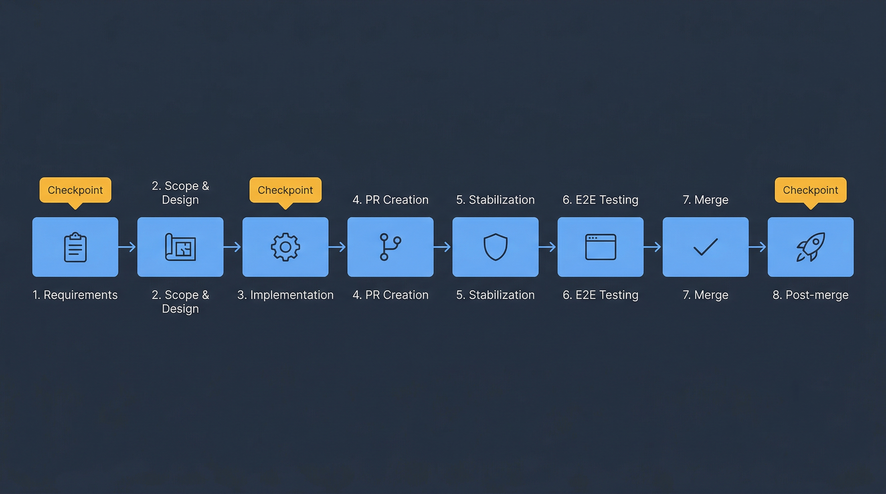
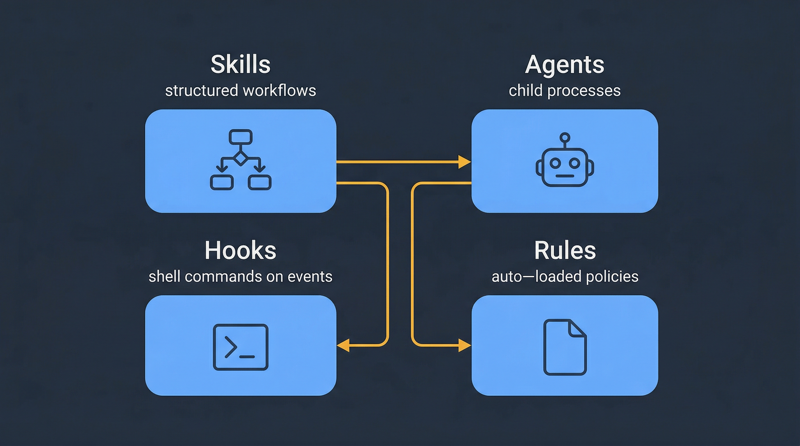

# DLC Plugin — Onboarding Guide

> **The plugin itself lives at [posterity-ventures/dlc-plugin](https://github.com/posterity-ventures/dlc-plugin).** This repo hosts the onboarding guide and its image assets separately so the plugin core stays small (< 5 MB).

---

# AI-DLC Onboarding Guide

Welcome. This guide takes a new user from zero to productive with the **AI-Driven Development Lifecycle (AI-DLC)** system in this repository. If you are looking for the machine-readable reference, head to the [skills guide](../skills-guide/README.md); this guide is meant to be read front-to-back the first time, then kept around as a runbook for common scenarios.

> **Short on time?** Read [core-workflow.md](core-workflow.md) and the playbook that matches your situation. That's enough to ship your first feature.

## What is the AI-DLC system?

A set of AI-driven **skills**, **agents**, **hooks**, and **rules** that automate the full software development lifecycle — from requirements analysis to merge-ready pull requests and post-merge closeout. It runs inside Claude Code, Cursor, and any other compatible agent harness. You describe what you want in plain language (or invoke a slash command like `/orchestrate-sdlc`), and the system drives the work through phase-by-phase delivery.

The building blocks in one sentence each:

- **Skills** — structured AI workflows defined in `.claude/skills/<name>/SKILL.md`. They are what the agent actually runs.
- **Agents (subagents)** — lightweight child agents the agent dispatches in parallel for focused work (exploration, coding, review, testing).
- **Hooks** — shell commands the harness runs automatically on lifecycle events (tool calls, subagent start/stop).
- **Rules** — short markdown documents in `.claude/rules/` that auto-load into every conversation as durable project policy.
- **Artifacts** — structured documents under `${DLC_ARTIFACT_ROOT:-.dlc}/<slug>/` (requirements, designs, plans, reviews, state) that form a feature's audit trail.
- **Worktrees** — `git worktree` isolation so multiple SDLC sessions can run in parallel without stepping on each other.

## Contents

### Start here

| Page | What you'll learn |
|------|-------------------|
| [Core workflow](core-workflow.md) | Installation, authentication, first session, mental model, end-to-end SDLC walkthrough |

### Scenario playbooks

Each playbook is a self-contained walkthrough with commands, expected artifacts, and decision points. Pick the one that matches your situation.

| Playbook | Situation |
|----------|-----------|
| [Product discovery](playbooks/discovery.md) | Raw idea, no scope yet — pick a framework (JTBD, Lean Canvas, SWOT+Kano, Porter's Five Forces, OST, Working Backward) and produce a grounded `discovery.md` brief that feeds `/analyze-requirements` |
| [Greenfield product development](playbooks/greenfield.md) | Starting from a PRD or product brief with no existing code — go from idea to first deploy |
| [Proof of concept](playbooks/poc.md) | Lightweight path that skips heavy gates, with criteria for promoting a POC to production work |
| [Brownfield maintenance](playbooks/brownfield.md) | Bug fixes, small features, working inside legacy code, test-coverage strategy |
| [Modernization](playbooks/modernization.md) | Large refactors, incremental migration, risk management, rollback planning |
| [Troubleshooting](playbooks/troubleshooting.md) | Common failure modes (CI loops, worktree collisions, hook failures, stale artifacts, MCP errors), diagnostic commands, escalation paths |
| [Product ↔ Dev collaboration](playbooks/product-dev-collaboration.md) | Cross-team handoff: Product runs `/product-discovery` → `/analyze-requirements` → `/create-issues`, Dev runs `/orchestrate-sdlc`, both sides run UAT |

### Reference

| Page | Purpose |
|------|---------|
| [Skills quick-reference](reference/skills-quickref.md) | Every skill on one page — purpose, example trigger, typical duration |
| [Agents quick-reference](reference/agents-quickref.md) | Every subagent on one page — model, tools, dispatch guidance |
| [Cheatsheet](reference/cheatsheet.md) | Hooks, telemetry, rules, modes — condensed reference card |
| [Glossary](reference/glossary.md) | Every term used in this guide, defined in one sentence |

## How to read this guide

- **First-time user?** Read [core-workflow.md](core-workflow.md), then work through the [greenfield playbook](playbooks/greenfield.md). You will understand the mental model by the time you finish your first feature.
- **Joining a team that already uses AI-DLC?** Read [core-workflow.md](core-workflow.md), skim the [playbooks table](#scenario-playbooks), and keep the [cheatsheet](reference/cheatsheet.md) open for your first few days.
- **Facing a specific problem?** Jump straight to the matching playbook. Each one is written to be read standalone.
- **Product / PM role?** Start with the [Product ↔ Dev collaboration playbook](playbooks/product-dev-collaboration.md) — it covers the PRD-to-issues handoff and UAT round-trip.
- **Incident response?** Go directly to [troubleshooting](playbooks/troubleshooting.md) and the [hotfix skill reference](../skills-guide/skills/hotfix.md).

## A word on safety

The AI-DLC system is powerful enough to create branches, push commits, open PRs, and close issues on your behalf. Every playbook in this guide explains exactly what the system will do, what it will **not** do without your confirmation, and how to reach the hard-pause gates. The default interaction mode is `confident`, which pauses at major phase boundaries — if you'd rather step through every decision, use `interactive`; if you'd rather let it run overnight, use `autopilot`. See [core-workflow.md](core-workflow.md#interaction-modes) for the tradeoffs.

---

Next: [Core workflow](core-workflow.md)
