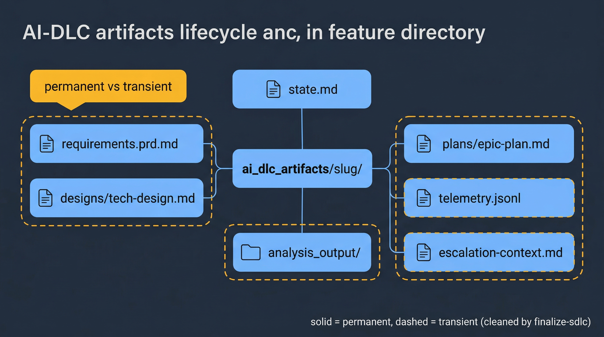
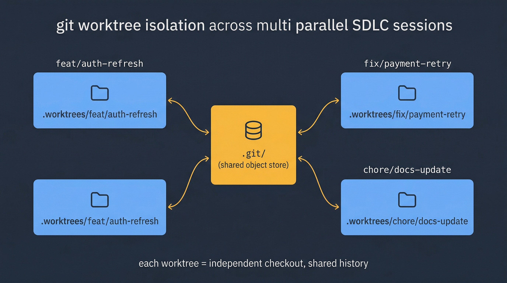

# Core Workflow

This is the first page every new user should read. By the end of it you should know how to install Claude Code, authenticate, start your first SDLC session, recognize the mental model (skills, agents, hooks, rules), and take a feature end-to-end from a plain-language request to a merge-ready PR.

## 1. Install and authenticate

Claude Code is the CLI harness that runs the AI-DLC system. Install it with a single npm command and sign in with your Anthropic API key (or OAuth) the first time you launch it:

```bash
npm install -g @anthropic-ai/claude-code
claude login   # first run only
```

Inside this repo, Claude Code picks up `.claude/settings.json` automatically on startup — that file wires the hooks, MCP servers, and permission allowlist. You do not need to edit it to get started.

Verify the install:

```bash
claude --version
cd /path/to/k2_mvp
claude   # launches an interactive session
```

If you see the Claude Code prompt and the session loads without warnings, you're ready. If MCP servers complain about missing env vars, populate `.env` with the keys listed in [skills-guide/mcp.md](../skills-guide/mcp.md#environment-variables) and restart.

## 2. Your first session — the one-line path

The shortest path from idea to merge-ready PR:

```
/orchestrate-sdlc build a /status endpoint that returns uptime and commit sha; autopilot
```

That's it. The orchestrator will:

1. Create a feature branch and isolated worktree.
2. Draft a PRD at `${DLC_ARTIFACT_ROOT:-ai_dlc_artifacts}/<slug>/requirements.prd.md`.
3. Run security / UX reviews only if triggers match (they won't here — this is a backend endpoint).
4. Produce a tech design at `${DLC_ARTIFACT_ROOT:-ai_dlc_artifacts}/<slug>/designs/tech-design.md`.
5. Plan and implement the work in Epic-sized increments, each with its own test coverage gate.
6. Open a PR with `prepare-pr`, run an isolated code review, and stabilize it through CI until it's merge-ready.
7. Hand control back to you for the merge click.

You can watch the [state file](../skills-guide/concepts.md#state-tracking-and-resume) update as the orchestrator moves through phases. Resume-safe: if you close the session mid-run, launch Claude Code again and type `resume the SDLC for <slug>` — it picks up where it left off by reading `${DLC_ARTIFACT_ROOT:-ai_dlc_artifacts}/<slug>/state.md`.

## 3. The mental model in 60 seconds

The AI-DLC system is a loose composition of five building blocks. You do not need to memorize all of them to ship — but knowing what they are makes the rest of this guide readable.



| Building block | Where it lives | What it does |
|----------------|----------------|--------------|
| **Skill** | `.claude/skills/<name>/SKILL.md` | A structured AI workflow the agent invokes. `orchestrate-sdlc`, `analyze-requirements`, `prepare-pr` are all skills. |
| **Agent (subagent)** | `.claude/agents/*.md` + platform catalog | A child agent the current agent dispatches for focused work. `coding-agent`, `explore-fast`, `reviewer` are subagents. |
| **Hook** | `.claude/hooks/*.sh` + `settings.json` | A shell command the harness runs automatically on tool-call events. Pre-push tests and telemetry are hooks. |
| **Rule** | `.claude/rules/*.md` | Short markdown policies that auto-load into every conversation. `branching.md`, `task-scope.md`, `push-protection.md`. |
| **Artifact** | `${DLC_ARTIFACT_ROOT:-ai_dlc_artifacts}/<slug>/` | The structured audit trail of a feature — PRD, design, plans, state, reviews. |

Rules of thumb:

- **You (the user) invoke skills.** Everything else is internal orchestration.
- **Skills dispatch agents and follow rules.** You rarely dispatch an agent directly yourself.
- **Hooks fire on events, not on your command.** They're invisible most of the time — you notice them when a pre-push test fails or when telemetry lands in your artifact directory.
- **Artifacts are the source of truth for a feature.** Anything the system "remembers" about your feature is in `${DLC_ARTIFACT_ROOT:-ai_dlc_artifacts}/<slug>/`.

For the full picture see [skills-guide/concepts.md](../skills-guide/concepts.md). You do not need to read it now.

## 4. Interaction modes

The orchestrator supports three interaction modes. Pick one per session based on how closely you want to supervise the run:

| Mode | When to use | Checkpoint behavior |
|------|-------------|---------------------|
| **interactive** | Learning the system, or the feature is risky/unfamiliar | Pauses at every checkpoint; presents details; invites discussion |
| **confident** (default) | Normal working mode for experienced users | Pauses at major phase boundaries only; presents a concise summary |
| **autopilot** | Overnight runs, backlog chores, or work you're comfortable rubber-stamping | Runs without pausing; self-reviews against rules and logs decisions to `state.md`; only stops at hard-pause gates (push, merge) |

Set the mode inline in the invocation: `/orchestrate-sdlc <description>; autopilot`. If you omit the mode, the orchestrator asks at the start and records your choice in `state.md` so resume keeps the same mode.

Three things are **always hard-paused** regardless of mode: direct pushes to `main`/`staging`/`prod` (refused outright), user-confirmation gates in the `hotfix` skill, and the Phase 8 deployment gate. The system errs on the side of asking when the blast radius is large.

## 5. End-to-end walkthrough

Here is what a single feature looks like end-to-end in confident mode. You type the first line; everything else is the system working.

```
> /orchestrate-sdlc add rate limiting to the /login endpoint; confident
```

1. **Phase 1 — Requirements.** The orchestrator asks whether you have a PRD or want one generated, then invokes `analyze-requirements` to write `${DLC_ARTIFACT_ROOT:-ai_dlc_artifacts}/add-login-rate-limiting/requirements.prd.md`. Presents a summary and asks: "Proceed to scope assessment?" You approve.

2. **Phase 2a — Scope assessment.** The orchestrator checks trigger rules and detects a security trigger (authentication code path). It tells you so and asks whether to run `review-security` before design. You say yes.

3. **Phase 2b — Security review.** `review-security` analyzes the current auth code and writes `${DLC_ARTIFACT_ROOT:-ai_dlc_artifacts}/add-login-rate-limiting/analysis_output/SECURITY_REVIEW_REPORT.md` with CRITICAL/HIGH findings. The orchestrator reports them and asks to proceed to design.

4. **Phase 2c — Tech design.** `produce-tech-design` reads the PRD and the security report, produces `designs/tech-design.md` with work items and a DAG, and asks whether to begin implementation.

5. **Phase 3 — Implementation.** The orchestrator loops through Epics. Each Epic goes: `plan-implementation` → parallel `coding-agent` subagents write the code → full test run → `build-unit-tests` measures coverage delta against the 60% gate → `align-pre-commit` polishes and commits. State is updated in the same commit as the Epic code. Pushes after each Epic.

6. **Phase 4 — PR creation.** `prepare-pr` syncs the branch with main, verifies the working tree, drafts a PR description that includes `Closes #<issue>` if the feature was linked to an issue, and opens the PR.

7. **Phase 5 — Stabilization.** An **isolated** `review-pr` subagent reviews the PR (with no implementation context — the reviewer sees it as an outsider would) and posts inline findings. `stabilize-pr` then triages those findings plus any external reviewer comments plus CI failures, auto-fixes high-confidence issues, and loops until the PR is merge-ready or a blocker needs your judgment.

8. **Phase 6 — E2E (conditional).** Skipped here — this is a backend-only change. If it were a UI change, `build-e2e-tests` would plan/run Playwright tests and re-stabilize.

9. **Phase 7 — You merge the PR.** The system hands control to you. Click merge in GitHub.

10. **Phase 8 — Post-merge.** You run `/finalize-sdlc` or the orchestrator resumes automatically; `finalize-sdlc` cleans up transient files under `${DLC_ARTIFACT_ROOT:-ai_dlc_artifacts}/<slug>/` (keeping PRD, tech design, and review reports), optionally promotes those permanent artifacts to `docs/<slug>/` via `maintain-docs`, waits for deployment, runs smoke tests, closes the linked issue with a structured comment, and updates the epic checklist.

Done. The feature is shipped, the issue is closed, and `${DLC_ARTIFACT_ROOT:-ai_dlc_artifacts}/<slug>/` contains the permanent audit trail (PRD, design, review report, telemetry).

## 6. What to read next

- **First feature**: [playbooks/greenfield.md](playbooks/greenfield.md) or [playbooks/brownfield.md](playbooks/brownfield.md), depending on whether you're starting from scratch or working in existing code.
- **Something specific went wrong**: [playbooks/troubleshooting.md](playbooks/troubleshooting.md).
- **Product/PM handoff**: [playbooks/product-dev-collaboration.md](playbooks/product-dev-collaboration.md).
- **Reference while working**: keep [reference/cheatsheet.md](reference/cheatsheet.md) open in a side tab.

## 7. Common first-session mistakes

Worth flagging up front so you can avoid them:

- **Pushing to `main` directly.** The `push-protection` rule refuses. Use `/orchestrate-sdlc`, or `/push-to-main` if you know what you're doing (it still asks).
- **Running Claude Code in the main working directory when multiple SDLCs are in flight.** Use worktrees. The orchestrator creates them for you automatically — just don't `cd` back to the repo root to "check something" and then invoke a skill, or you'll operate on the wrong branch. See [worktree-safety.md](../../rules/worktree-safety.md).

  

- **Reading `CLAUDE.md` for instructions.** `CLAUDE.md` is intentionally 40 lines — real instructions live in `.claude/rules/` and the skill files. See [skills-guide/rules.md](../skills-guide/rules.md).
- **Abandoning a run mid-phase without a state file update.** Don't. Run `resume the SDLC for <slug>` and let the orchestrator close the phase cleanly, or explicitly mark the phase `skipped` in `state.md` before starting something new.

## 8. How the system decides things when you're not watching

Autopilot is not silent — it logs every non-trivial decision to `state.md` under the **Decisions Log** section, tagged `AUTOPILOT DECISION`. You can audit the run afterward by reading that log alongside `telemetry.jsonl`. If a decision looks wrong, the fix is usually to either provide more context in the initial prompt or to switch to confident mode for the next feature in the same area.

The orchestrator applies a few universal guardrails regardless of mode:

- **Never skip Phase 1 (requirements) or Phase 2c (tech design).** Even autopilot pauses if they can't complete.
- **Never skip UX review when triggered.** Reading source code is not a substitute for live screenshots.
- **Never modify `.claude/` files** unless you explicitly ask. That directory is user-owned.
- **Never force-push, never squash a promotion PR.** See [branching.md](../../rules/branching.md) for why.

Those are the rails. Everything else is negotiable.

## 9. Branching model configuration — read this if you're adopting `.claude/` in another repo

The branching model is declared in `.claude/branching.json` and consumed by skills via a config-driven adapter. This repo ships with **GitLab Flow** (`main → staging → prod`), but four presets are supported out of the box:

| Preset | Integration branch | Env branches | Hotfix targets |
|--------|--------------------|--------------|----------------|
| `gitlab-flow` | `main` | `staging`, `prod` | `prod`, `staging` |
| `github-flow` | `main` | *(none)* | `main` |
| `gitflow` | `develop` | `main` | `main` |
| `trunk-based` | `main` | *(none)* | `main` |

To adopt a different model, replace `.claude/branching.json` with the matching preset from `.claude/skills/_shared/branching-model.md`. Skills that depend on branch names (`hotfix`, `prepare-pr`, `push-protection`) read from the config automatically — no code changes required.

Skills without branching assumptions (`analyze-requirements`, `produce-tech-design`, `plan-implementation`, `build-unit-tests`, `review-security`, `review-ux`, `maintain-docs`, `image-generation`) work on any flow regardless of config.

---

Next: pick a playbook that matches your situation → [README.md#scenario-playbooks](README.md#scenario-playbooks).
