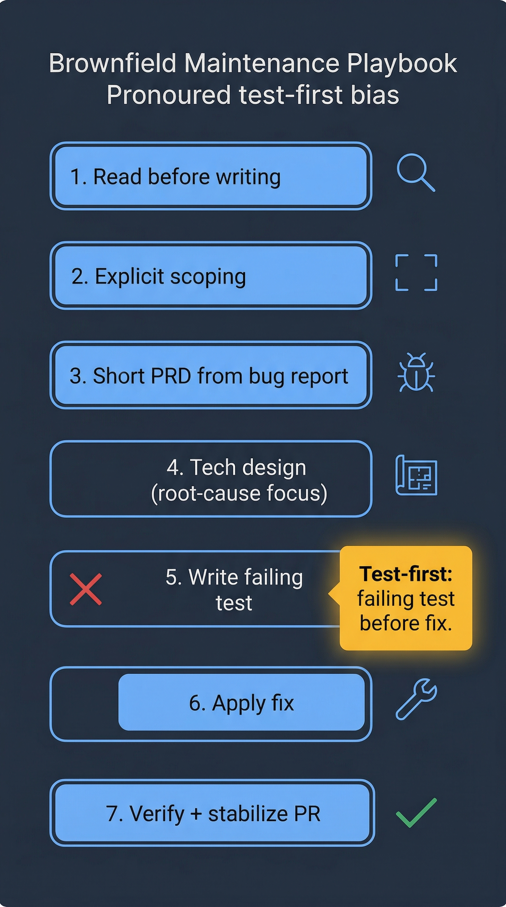

# Playbook — Brownfield Maintenance

You are fixing a bug, adding a small feature inside existing code, or working through tech-debt inside a legacy module. The code has context you do not fully own — it was written by someone else, over a long time, and has behaviors you cannot predict from reading headers alone. This playbook shows how to use the AI-DLC system safely in that environment.



## When to use this playbook

- Bug reported by a user or by monitoring
- Small enhancement to an existing feature (an extra field, a new option)
- Refactor a function without changing its external contract
- Increase test coverage on a legacy module
- Migrate from a deprecated API in one call site

For larger changes (rewrite a subsystem, swap a dependency, restructure data flow), use [modernization.md](modernization.md) instead.

## 1. Start by reading, not writing

The most common brownfield failure is writing a fix before understanding the code. Before invoking any skill, use the `explore-fast` subagent pattern:

```
Read the code in <module path> and explain how <behavior> currently works. Do not propose changes yet.
```

You can do this in a fresh Claude Code session or as a precursor to `/orchestrate-sdlc`. The goal is to build a mental model first. If you cannot describe the current behavior in 3 sentences, you are not ready to fix it.

See the [explore-fast agent reference](../../skills-guide/agents.md) for what this subagent is good at.

## 2. Kick off the SDLC with explicit scoping

```
/orchestrate-sdlc fix <bug description>, limit scope to <module>; confident
```

The `limit scope to` phrase is important. Without it, coding subagents may notice adjacent smells and "opportunistically" fix them — which multiplies risk. The [task-scope rule](../../../rules/task-scope.md) already enforces this at the rule level, but restating it in the invocation makes the first phase faster.

If you have a GitHub issue for the bug, pass the issue number:

```
/orchestrate-sdlc 2154; confident
```

The orchestrator will read the issue body (which should describe the bug and the reproduction), infer scope, and start Phase 1 with the issue as the requirements anchor.

## 3. Phase 1 — Requirements on a brownfield run

`analyze-requirements` handles brownfield differently from greenfield:

- It treats the **bug report** as the primary input instead of a PRD.
- The acceptance criteria become: "bug no longer reproduces," "no regression in related behavior," "new test covers the regression."
- It explicitly calls out "do not change unrelated behavior" as a non-functional requirement.

If the bug is poorly reported (e.g., "the feed is broken"), the skill will ask clarifying questions: environment, steps to reproduce, expected vs actual output. Answer concretely.

## 4. Phase 2 — Scope assessment and tech design

Phase 2a may still trigger security/UX review on a brownfield bug — for example, if the bug is in an auth code path. Do not suppress those reviews even if you believe the fix is trivial. A two-line change in authentication has shipped CVEs before.

Phase 2c (`produce-tech-design`) is typically very short for brownfield work: a half-page design that identifies the root cause, the fix strategy, and the specific files touched. If the design says "change file X and file Y" but the root-cause analysis is missing, stop and push back — fixing symptoms without understanding the cause is how brownfield bugs come back.

## 5. Phase 3 — Implementation with a test-first bias

For brownfield, the orchestrator runs `build-unit-tests` **before** the fix when possible:

1. Write a test that reproduces the bug (the test should currently fail)
2. Apply the fix
3. Verify the test now passes
4. Measure coverage delta against the 60% gate

This order catches two failure modes: "fix didn't actually work" and "the bug wasn't what we thought it was." It also gives you a regression test for free.

If the bug is hard to reproduce in a unit test (concurrency, timing, external system), write an integration test instead. The `build-unit-tests` skill understands this and will adjust its approach — see the [build-unit-tests reference](../../skills-guide/skills/build-unit-tests.md).

### Coverage strategy on legacy modules

Legacy modules often sit well below the 60% coverage gate. When you fix a bug in one of them, `build-unit-tests` only measures **coverage delta** on the lines you touched — it does not require you to bring the whole module up to 60%. The skill explicitly documents this in its decisions log. If the gate blocks you because the whole-module coverage dropped, escalate — that is a sign the measurement is miscounting, not that you should write dozens of unrelated tests.

## 6. Phase 4–5 — PR and stabilization

Brownfield PRs get the same `review-pr` + `stabilize-pr` loop as greenfield. The reviewer knows nothing about your investigation — it sees the diff fresh. Expect findings like:

- "Why did this behavior change?" → answer is in your PRD/design
- "Are there other callers that depend on the old behavior?" → the reviewer will have searched; if not, search yourself
- "Is there a test for the regression case you fixed?" → there should be, because you wrote it in step 5

`stabilize-pr` will auto-fix high-confidence findings and surface the rest for your judgment. See [stabilize-pr reference](../../skills-guide/skills/stabilize-pr.md).

## 7. Hotfix path (out-of-band brownfield)

If the bug is **actively causing user-visible harm** in production and you cannot wait for the normal SDLC, use the `hotfix` skill instead:

```
/hotfix <bug description>
```

Hotfix is a separate skill with its own workflow: branch from `prod`, minimal diff, two hard-pause gates, explicit revert mode. See the [hotfix skill reference](../../skills-guide/skills/hotfix.md) and the [troubleshooting playbook](troubleshooting.md#hotfix-path) for the full incident-response walkthrough.

Use hotfix only for true incidents. Regular bugs go through `/orchestrate-sdlc`.

## 8. Post-merge: watch for regressions

Brownfield fixes are the most likely class of change to introduce a regression in a different code path. After merge:

1. Let `finalize-sdlc` run its smoke tests.
2. Check the relevant dashboard (error rate, latency, business metric) for 1–2 hours after deploy.
3. If a regression appears, revert via `/hotfix revert <commit>` — do not attempt to patch forward.

The cost of a revert is cheap; the cost of a bad patch-on-patch loop is not.

## 9. Common brownfield pitfalls

- **Fix without reproduction.** If you cannot reproduce the bug locally, you cannot verify the fix. Push back on bug reports that lack a reproduction.
- **Scope creep.** "While I'm here" is how a 3-line fix becomes a 300-line PR. Use a separate branch for the cleanup.
- **Assuming the tests pass = it works.** For brownfield bugs, the existing test suite probably passes before your fix and after. That's why you add a new test that fails before the fix.
- **Editing files you did not read.** The coding subagents will decline to do this, but so should you. Always read the surrounding context before making changes.
- **Ignoring the [task-scope rule](../../../rules/task-scope.md).** It exists because brownfield scope creep is the most common class of SDLC failure in this repo.

## Next

- Your fix is big enough that it needs a phased rollout? Use [modernization.md](modernization.md).
- The bug is actively in production and customers are affected? Use the hotfix path in [troubleshooting.md](troubleshooting.md#hotfix-path).
- You are pairing with a product manager on this fix? See [product-dev-collaboration.md](product-dev-collaboration.md).
