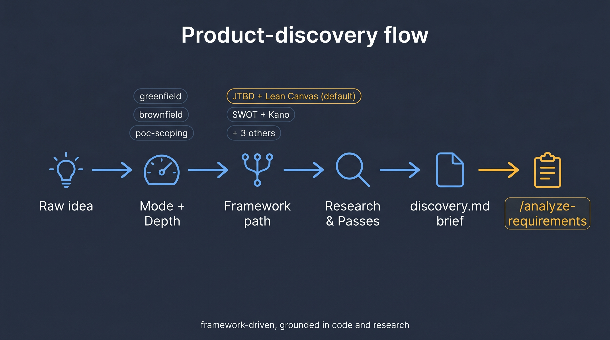
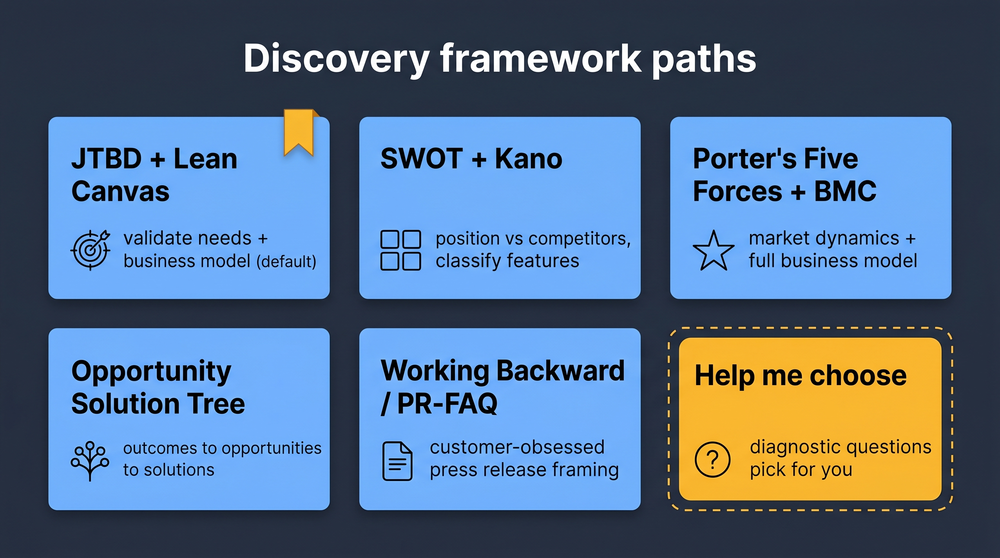

# Playbook — Product Discovery

You have a raw idea but no clear scope, user stories, or acceptance criteria yet. Writing a PRD directly would be premature — you'd invent details you haven't actually decided on. This playbook walks through `/product-discovery` (alias `/discover`), which runs a framework-driven discovery session and produces a grounded `discovery.md` brief that feeds `/analyze-requirements`.

> **Prerequisite**: you have read [core-workflow.md](../core-workflow.md) and have Claude Code running inside the repo root.



## When to run discovery

Run it when:

- You can describe the idea in one sentence but not scope it into features.
- You're not sure which customer problem this solves, or whether the problem is real.
- You have a direction but no opinion on must-have vs. nice-to-have.
- You need to pitch this to a stakeholder before committing engineering time.

Skip it when:

- You already have a PRD, product brief, or a clear GitHub issue with scope — jump straight to `/analyze-requirements` or `/orchestrate-sdlc`.
- You're fixing a known bug or making a maintenance change — use [brownfield](brownfield.md).
- The scope is inherently tiny and exploratory — use [poc](poc.md).

## 1. Kick off discovery

```
/discover <one-sentence idea>
```

or

```
/product-discovery <one-sentence idea>
```

Both invocations do the same thing. Example:

```
/discover I'm thinking about adding a recommendation engine to our search product
```

## 2. Pick a mode

The skill asks three setup questions via structured prompts. First is the **mode**:

| Mode | When to pick | Typical length |
|------|--------------|----------------|
| **greenfield** | New product or product line; no existing code to ground against | 15–30 min |
| **brownfield** | Extending or replacing something that already exists in the repo; codebase grounding on | 10–25 min |
| **poc-scoping** | "Should we POC this?" lightweight feasibility check; ends with a promote/defer recommendation | 5–15 min |

## 3. Pick a depth

| Depth | Research budget | Framework passes |
|-------|-----------------|------------------|
| **light** | 2 subagents, 1 web search, skip Context7 | Framework headers only — no deep fills |
| **standard** (default) | 4 subagents, 2–4 web searches, Context7 on third-party deps | Full framework passes |
| **deep** | 6+ subagents, 5+ web searches, exhaustive grounding | Full + sensitivity analysis |

Default is **standard**. Pick **light** for a 10-minute sanity check; **deep** for high-stakes bets.

## 4. Pick a framework path

This is the most consequential choice — it determines which sections the discovery brief will actually populate.



| Option | When it's the right pick |
|--------|--------------------------|
| **JTBD + Lean Canvas** (default) | Most new-product situations. Validates customer needs (Jobs-to-be-Done) then tests the business model on a single page (Lean Canvas). Safe default when you're unsure. |
| **SWOT + Kano** | Evolving an existing product against competitors. SWOT locates your position; Kano classifies features as must-have / performance / delighter. |
| **Porter's Five Forces + Business Model Canvas** | Entering a new market or designing a full business model. Heavier; pick when "go / no-go" is a board-level question. |
| **Opportunity Solution Tree (OST)** | You have a target outcome but need to enumerate opportunities and map solution options before picking one. Visual tree output. |
| **Working Backward / PR-FAQ** | Customer-obsessed framing. Writes the press release and FAQ as if the product shipped. Forces clarity about the "so what?". |
| **Help me choose** | You're not sure. The skill asks 3–5 diagnostic questions about stage, goals, data availability, and org type, scores the frameworks against a 17-row decision matrix, and recommends the best fit. Always overridable. |

For the full decision matrix, see the [product-discovery skill reference](https://github.com/posterity-ventures/dlc-plugin/blob/main/docs/skills-guide/skills/product-discovery.md) and `skills/product-discovery/references/routing-matrix.md` in the plugin.

## 5. What the skill does behind the scenes

1. **Research.** Parallel `explore-fast` subagents run — codebase grounding (brownfield / poc-scoping modes), documentation & prior-art scan, overlap detection (reuses `map-codebase` if a recent map exists), market/competitive research (greenfield mode).
2. **Framework passes.** Runs the selected framework(s) with the gathered evidence. JTBD produces job statements; Lean Canvas fills nine slots; OST builds a tree; etc.
3. **MoSCoW backlog construction.** Derives a prioritized backlog (`Must` / `Should` / `Could` / `Won't`) grounded in framework output.
4. **Concerns heuristics scan.** Runs checks for common failure modes (unclear primary persona, unvalidated assumption, scope overrun) and flags them.
5. **RAID log.** Risks / Assumptions / Issues / Decisions with IDs that carry forward into the PRD.
6. **Scope clusters.** Groups backlog items into coherent scope slices — each cluster is a plausible PRD scope.

## 6. Output

```
${DLC_ARTIFACT_ROOT:-ai_dlc_artifacts}/discovery/YYYY-MM-DD-<slug>.discovery.md
```

Sections you'll see in the brief:

- **Header** — mode, depth, framework path, date, author
- **Raw input summary** — what you gave it, cleaned up
- **Framework analysis** — one section per framework pass (JTBD statements, Lean Canvas cells, SWOT quadrants, etc.)
- **MoSCoW backlog** — prioritized items with IDs that map to future FRs
- **RAID log** — R-x / A-x / I-x / D-x entries
- **Scope clusters** — 2–4 plausible PRD scopes, each with inclusion/exclusion rationale
- **Concerns heuristics** — flagged issues and recommended `/review-*` follow-ups
- **Recommendation** — next action (typical: "proceed to `/analyze-requirements` with scope cluster X")

## 7. What to do with the brief

| Situation | Next step |
|-----------|-----------|
| You're confident in one scope cluster | `/analyze-requirements --discovery <path-to-discovery.md>` — the brief pre-populates Phase 1 and the resulting PRD cites the discovery artifact |
| Two clusters look viable | Make the call yourself, or run a short PoC per [poc.md](poc.md); update the brief's Decisions section with `D-x: chose cluster Y because ...` |
| Critical concerns flagged | Run the recommended `/review-*` skill(s) before committing to requirements |
| The brief reveals this isn't the right problem | Stop. Don't write a PRD for a problem you no longer believe in. Archive the brief — it's still audit trail for "why we didn't build this." |

## 8. Common first-time mistakes

- **Picking "deep" by default.** Overkill for most ideas. Start `standard`; escalate if the brief is thin.
- **Skipping the mode question.** The mode gates which subagents run. Picking `greenfield` for a brownfield extension leaves the codebase ungrounded and the brief will miss obvious reuse opportunities.
- **Choosing a framework you've heard of instead of the one that fits.** If unsure, pick "Help me choose." The routing matrix almost always converges on JTBD + Lean Canvas anyway, but you'll understand *why*.
- **Treating the brief as a PRD.** It isn't. It's scaffolding. PRD-specific work (acceptance criteria, edge cases, explicit out-of-scope) still happens in `/analyze-requirements`.

## 9. Modes in autopilot

In autopilot mode the skill will infer mode + depth + framework from your input and the decision matrix, write a Decisions Log block, and proceed. It still hard-pauses if the input is ambiguous enough that the matrix can't score a winner. Pass `--framework <slug>` in autopilot to force a specific path and skip inference entirely.

## 10. Related

- [analyze-requirements](https://github.com/posterity-ventures/dlc-plugin/blob/main/docs/skills-guide/skills/analyze-requirements.md) — the natural next step
- [Greenfield playbook](greenfield.md) — once you have a PRD from the discovery brief
- [Product ↔ Dev collaboration playbook](product-dev-collaboration.md) — how discovery hands off between product and engineering
- [Cold-start playbook](cold-start.md) — discovery + mapping + feature kickoff for unfamiliar codebases

---

Next: [greenfield.md](greenfield.md) (if you have a scope picked) or [product-dev-collaboration.md](product-dev-collaboration.md) (if discovery was a Product-side activity and handoff is next).
