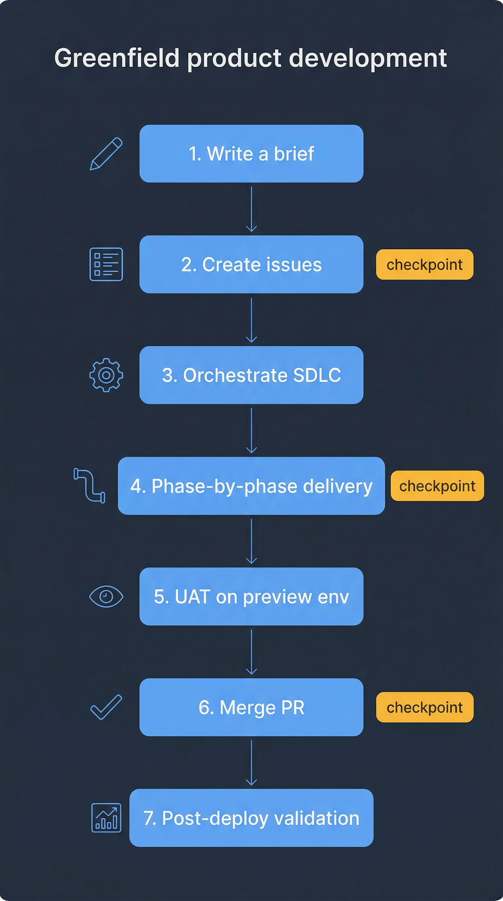

# Playbook — Greenfield Product Development

You have a PRD, a product brief, or a plain-language description of something that does not yet exist in the repo. You want the AI-DLC system to take you from that starting point through a first deploy. This playbook walks through that path end-to-end.

> **Prerequisite**: you have read [core-workflow.md](../core-workflow.md) and have Claude Code running inside the repo root.



## 1. Decide what you actually want

Before invoking any skill, write one paragraph answering:

- What is the feature for? (Who is the user, what problem does it solve.)
- What does "shipped" mean? (New endpoint live in staging? UI visible to beta users? A CLI command others can run?)
- What are the non-negotiable constraints? (Latency budget, security posture, data privacy, infra boundaries.)

If you already have a PRD or a product brief, skip to step 2. If not, paste this paragraph directly into Claude Code and say: **"Use `/analyze-requirements` to turn this into a PRD."** The skill will ask clarifying questions, draft the PRD, and stop at a checkpoint for your approval.

The output lands at `${DLC_ARTIFACT_ROOT:-ai_dlc_artifacts}/<slug>/requirements.prd.md`. You own the content — edit it if the skill misrepresented intent.

## 2. (Optional) Create tracking issues from the PRD

Greenfield features usually benefit from tracking issues: one for the overall epic, one per deliverable theme. Run:

```
/create-issues
```

The skill reads the PRD, proposes a set of issues (epic + children), shows you the full list, and only creates them in GitHub after you approve. You get back the issue numbers — save them. You will reference the epic issue from the orchestrate run.

See the [create-issues skill reference](../../skills-guide/skills/create-issues.md) for the label taxonomy, epic linking behavior, and how to reuse an existing epic instead of creating a new one.

## 3. Kick off the SDLC

```
/orchestrate-sdlc build <feature-name-in-plain-language>; confident
```

If you ran `/create-issues` first, replace `<feature-name-in-plain-language>` with the issue number (e.g., `/orchestrate-sdlc 1447; confident`). The orchestrator will self-assign the issue, create a worktree, and begin Phase 1.

For a true first-time greenfield run, use `confident` mode (the default). `interactive` is slower than you will want; `autopilot` is fine once you trust the system on a particular kind of work but can surprise you on the first feature in an unfamiliar area.

## 4. Phase-by-phase expectations

| Phase | What you will see | How long |
|-------|-------------------|----------|
| **1 — Requirements** | Draft PRD (or re-confirmation of the one you provided) + checkpoint | 1–5 min |
| **2a — Scope assessment** | Brief log entry naming trigger matches (security / UX) | seconds |
| **2b — Pre-design reviews** | If triggered: `review-security` and/or `review-ux` produce a report under `${DLC_ARTIFACT_ROOT:-ai_dlc_artifacts}/<slug>/analysis_output/` | 2–8 min each |
| **2c — Tech design** | `produce-tech-design` writes `designs/tech-design.md` with epics, work-item DAG, decisions | 3–10 min |
| **3 — Implementation** | Epic loop: plan → parallel coding subagents → unit tests → coverage gate → polish → commit → push | 10–60 min per epic |
| **4 — PR creation** | `prepare-pr` syncs with main, drafts a description, opens the PR | 1–2 min |
| **5 — PR stabilization** | Isolated `review-pr` run + `stabilize-pr` loop until the PR is merge-ready | 5–30 min |
| **6 — E2E testing** | Only if UI was touched: `build-e2e-tests` plans/runs Playwright, restabilizes | 10–45 min |
| **7 — You merge** | Hard pause. You click merge in GitHub | your call |
| **8 — Post-merge** | `finalize-sdlc` cleans up artifacts, waits for deployment, runs smoke tests, closes the linked issue, ticks the epic checklist | 5–20 min |

Between phases, the orchestrator summarizes what happened and either continues (confident mode) or asks permission (interactive mode).

## 5. First-deploy specifics

On a fresh feature the first deploy usually needs two extra things the SDLC will not do automatically:

- **Secrets provisioning.** If the feature reads a new env var, add it to the secret store and the K8s ConfigMap before merging. The orchestrator will call this out in Phase 4 if it detects new env var references.
- **Migration review.** If the feature introduces a database migration, Phase 2b should have picked it up; double-check that the PR description lists the migration file and any runbook steps. If it doesn't, ask the orchestrator to re-run Phase 5 stabilization with "re-check migration safety" in the prompt.

Both of these are called out as checkpoints in `stabilize-pr`. See [stabilize-pr reference](../../skills-guide/skills/stabilize-pr.md).

## 6. Verifying the deploy

After merge, the orchestrator runs `finalize-sdlc` which:

1. Waits for the Flux reconciliation to pick up the new image tag (see [CLAUDE.local.md](../../../../CLAUDE.local.md#deployment) for the Flux model).
2. Runs post-deploy smoke tests if they are defined in the epic plan.
3. Posts a structured closeout comment on the linked issue.
4. Updates the epic issue's checklist with a tick for this feature.

If any step fails, `finalize-sdlc` escalates — it will not silently skip a failed smoke test. See [finalize-sdlc reference](../../skills-guide/skills/finalize-sdlc.md).

## 7. Hand-off to the team

At this point:

- `${DLC_ARTIFACT_ROOT:-ai_dlc_artifacts}/<slug>/` is the permanent audit trail. Keep it in the repo — do not delete it.
- The feature branch is merged and deleted. The worktree can be cleaned up with `git worktree remove .worktrees/<slug>`.
- The linked issue is closed with a structured comment listing the PR, deploy time, and smoke-test results.
- The epic issue checklist is updated.

Share the PR link and the closeout comment with your team. If you opened the greenfield work as part of a larger product initiative, go back to the epic issue and look at its remaining checklist items — those become the next SDLC runs.

## 8. Common greenfield pitfalls

- **Under-specified PRD.** If the PRD has fewer than 5 explicit acceptance criteria, the orchestrator will either loop at Phase 1 asking for more or make up criteria. Give it concrete, testable statements.
- **Two greenfield runs on overlapping code.** Use two worktrees and two slugs. See [worktree-safety rule](../../../rules/worktree-safety.md).
- **Skipping scope assessment.** Phase 2a is cheap and catches the single most common class of mistake (missing security/UX review on a feature that touches auth or UI). Never tell the orchestrator to skip it.
- **Confusing "merge-ready" with "deployed."** Phase 5 ends at merge-ready. You still have to click merge. Phase 8 is the one that actually validates deploy.

## Next

- Second feature in the same area? Run `/orchestrate-sdlc` again with a new slug. The orchestrator remembers nothing between runs except what is on disk under `${DLC_ARTIFACT_ROOT:-ai_dlc_artifacts}/`.
- Need a lighter-weight path? See [poc.md](poc.md).
- Bug fix or small change inside this feature later? See [brownfield.md](brownfield.md).
