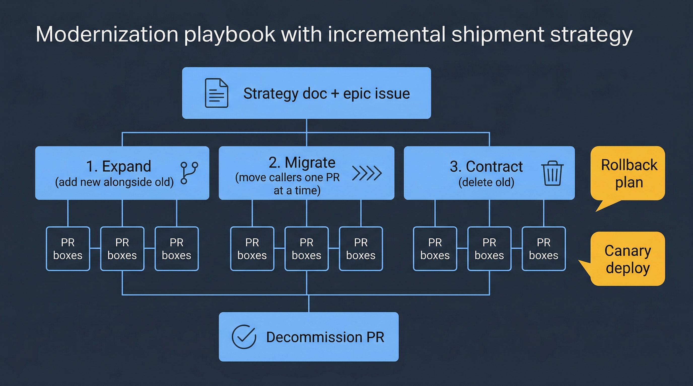

# Playbook — Modernization

You have a large refactor, a dependency migration, a platform swap, or a cross-cutting rewrite. The work cannot be done in a single PR without blowing up review, and a naive approach will introduce regressions that are expensive to recover from. This playbook shows how to use the AI-DLC system on that kind of work safely.



## When to use this playbook

- Migrate from one framework version to another (e.g., React 18 → React 19, Django 4 → 5)
- Swap a dependency (old logger → new logger, one queue library → another)
- Restructure a data model or API contract that touches many callers
- Decompose a monolith into services, or re-merge services
- Migrate infrastructure (Helm → Kustomize, one CI platform → another)
- Rewrite a subsystem whose current state is unmaintainable

If the change is a localized bug fix or small feature, use [brownfield.md](brownfield.md) instead.

## 1. Write a strategy doc before any code

Modernization without a strategy doc is how multi-month rewrites land in a ditch. Before invoking any skill:

1. Write a one-page strategy doc answering: **What is the target state? What are the concrete milestones? What is the rollback plan at each milestone?**
2. Commit it to the repo (e.g., at `docs/modernization/<topic>.md`) so reviewers can reference it.
3. Create an **epic issue** in GitHub linking to the strategy doc. This epic will own every SDLC run the modernization produces.

The strategy doc is the single artifact that does not live under `${DLC_ARTIFACT_ROOT:-.dlc}/` — it lives in `docs/` because it survives individual feature runs.

## 2. Decompose into incrementally shippable chunks

The key constraint: **each increment must leave `main` in a working state.** You cannot merge a half-migrated module. If an increment would require holding multiple PRs open together, the increment is too big.

Standard decomposition patterns:

| Pattern | How it works | When to use |
|---------|--------------|-------------|
| **Parallel-change (expand / migrate / contract)** | 1. Add new alongside old. 2. Migrate callers one PR at a time. 3. Delete old after all callers have moved. | API changes, data-model changes |
| **Feature flag** | New code behind a flag off by default. Ship with flag off; flip per environment. | Runtime swaps with rollback requirement |
| **Strangler fig** | New subsystem shadows old; traffic gradually moves. Old removed at end. | Subsystem rewrites |
| **Branch by abstraction** | Introduce an abstraction layer; swap the implementation behind it. | Dependency swaps |

Pick one. Document it in the strategy doc.

## 3. Create a tracking epic and child issues

Run `/create-issues` with the strategy doc as the input:

```
/create-issues modernize <topic> per docs/modernization/<topic>.md; create one epic and one issue per increment
```

The skill reads the strategy, proposes an epic and a child issue per increment, shows you the list, and only creates them after approval. The epic issue becomes the anchor for every increment PR and the single place stakeholders watch for progress.

See [create-issues reference](https://github.com/posterity-ventures/dlc-plugin/blob/main/docs/skills-guide/skills/create-issues.md) for the label taxonomy and epic linking behavior.

## 4. Run one SDLC per increment

For each child issue in the epic:

```
/orchestrate-sdlc <issue-number>; confident
```

Each run produces its own worktree, its own artifacts directory, its own PR. The epic checklist ticks off one item per merged PR.

**Do not run increments in parallel on overlapping code.** You can run them in parallel on disjoint modules — worktrees keep them isolated. See the [worktree-safety rule](https://github.com/posterity-ventures/dlc-plugin/blob/main/rules/worktree-safety.md).

## 5. Risk management per increment

Modernization increments have a different risk profile than ordinary features. The orchestrator handles some of this automatically, but you should explicitly ask for the rest:

### Require a rollback plan

Every increment's tech design should include a **Rollback** section naming the specific commit to revert to, the feature flag to flip off, or the env var to unset. Ask for it in the initial invocation if the orchestrator does not include it automatically:

```
/orchestrate-sdlc <issue-number>; confident; include explicit rollback plan in tech design
```

### Require a canary deploy

For increments that touch the hot path (request handling, database writes, payments), add a canary requirement:

```
...; deploy canary-first with 5% traffic for 1 hour before full rollout
```

`finalize-sdlc` Phase 8 understands canary waits — see [finalize-sdlc reference](https://github.com/posterity-ventures/dlc-plugin/blob/main/docs/skills-guide/skills/finalize-sdlc.md).

### Require enhanced monitoring

Ask `produce-tech-design` to include a "Monitoring additions" section: new metrics, new alerts, new dashboards. This is the difference between catching a regression in 5 minutes and catching it next quarter.

## 6. Reconcile scope drift

On a long-running modernization, the ground shifts. Other PRs land on `main` that affect your migration. When an increment PR fails to rebase cleanly:

1. Re-read the strategy doc — has the target state moved?
2. Ask the orchestrator to re-run Phase 2c (tech design) for the affected increment with a delta:
   ```
   resume the SDLC for <slug>, re-run tech design to account for <what changed on main>
   ```
3. Let `sdlc-deliver` re-stabilize from Phase 5 onward.

The [sdlc-deliver reference](https://github.com/posterity-ventures/dlc-plugin/blob/main/docs/skills-guide/skills/sdlc-deliver.md) documents the design-level escalation path — it routes back through the dispatcher rather than forcing you to start from Phase 1.

## 7. Decommissioning the old code

The final increment in a modernization is often "delete the old code." This is a separate SDLC run, with its own PR. Before running it:

1. Verify the epic checklist is complete — every caller has migrated.
2. Search the codebase for any remaining references to the old API/module/flag.
3. Confirm no open PRs reference the old code.

Then:

```
/orchestrate-sdlc delete <old module> per docs/modernization/<topic>.md; confident
```

The orchestrator will treat the deletion as a normal feature: tech design, tests (verifying nothing uses it), PR, stabilization. If anything still uses it, stop — the earlier increments were incomplete.

## 8. Close the epic

Once the decommission PR merges, `finalize-sdlc` ticks the last epic checklist item. Post a retrospective comment on the epic issue: what went well, what would you do differently, and what metrics changed (latency, error rate, build time, LOC). Then close the epic.

## 9. Common modernization pitfalls

- **No strategy doc.** You will lose alignment within 2 weeks. Write the doc first.
- **Big bang PR.** The PR will be unreviewable and any regression will be undiagnosable. Decompose.
- **Skipping the rollback plan.** You will need it, and it is trivial to include up front and extremely expensive to reconstruct under pressure.
- **Merging increments out of order.** The parallel-change pattern requires strict ordering. Do not skip steps.
- **Letting the migration "pause" half-done.** Old and new coexisting is a liability, not a resting state. Either finish the migration or roll it back.
- **Coupling the modernization to unrelated work.** Every increment should be pure modernization. If you start mixing in feature work, review complexity doubles.

## Next

- An increment turned into an incident? See [troubleshooting.md](troubleshooting.md) and the hotfix path.
- Need to coordinate the modernization with product/PM stakeholders? See [product-dev-collaboration.md](product-dev-collaboration.md).
- Modernization done; now returning to feature work in the same area? See [greenfield.md](greenfield.md) or [brownfield.md](brownfield.md) depending on whether the feature is new.
