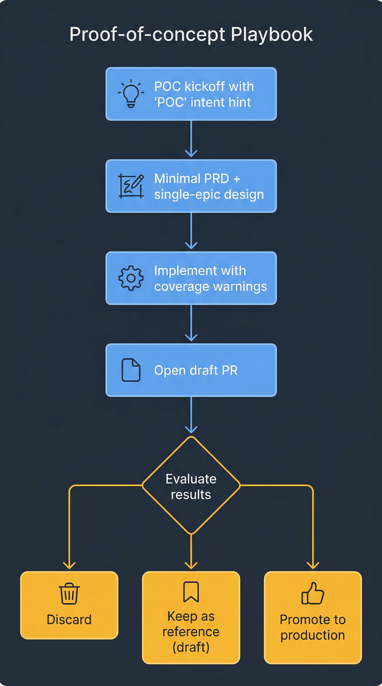

# Playbook — Proof of Concept

You want to try an idea end-to-end without committing to production-grade rigor. Maybe it will ship, maybe it will not. This playbook shows how to use the AI-DLC system on the lightweight path, and how to promote a POC to real production work once it proves itself.



## What a POC looks like in this repo

A POC is still a feature — it lives on a branch, has a worktree, produces an SDLC artifact directory, and opens a PR. What changes is the **rigor dial**:

- Shallow requirements (a short description is fine)
- No pre-design security/UX reviews unless triggers clearly match
- Test coverage below the default 60% gate is acceptable
- PR may be marked `draft` until promotion
- No post-merge deploy validation — stops at merge-ready

Everything else (branching, commits, PR creation, reviewer loop) still runs. The value of the system on a POC is speed and consistency — you are paying the harness cost anyway.

## 1. Kick off with an explicit POC intent

```
/orchestrate-sdlc POC: try <idea>; confident
```

Or, if you want a looser one-liner:

```
/orchestrate-sdlc quick POC for <idea>, skip heavy gates; confident
```

The orchestrator recognizes "POC" / "proof of concept" / "quick spike" as an intent hint and adjusts defaults:

- `analyze-requirements` writes a **short-form** PRD with minimal acceptance criteria
- `produce-tech-design` emits a single-epic plan
- `build-unit-tests` treats the 60% coverage threshold as a **warning**, not a gate (logs a decision but does not block)
- `prepare-pr` opens the PR with `draft: true`

Autopilot is **not recommended** on POCs. The whole point is that you are exploring — you want to be in the loop to redirect quickly. Use `confident`.

## 2. What still runs regardless

Certain phases still execute because skipping them would undermine the value of the harness:

- **Phase 1 (requirements)** — even a one-sentence PRD forces you to articulate what you are trying to learn. The orchestrator will not run without it.
- **Phase 2c (tech design)** — a short design doc (half a page) is still produced. It exists so the implementation subagents have a shared contract.
- **Phase 3 (implementation)** — the epic loop still runs. Tests are still written. Coverage is still measured (just not gated).
- **Phase 4 (PR creation)** — still opens a PR. That is how the POC becomes reviewable.
- **Phase 5 (stabilization)** — still runs the reviewer subagent. You will get the feedback; you are free to defer most of it.

What's *different* is interpretation: you can leave `MAJOR` and `MINOR` findings open on a POC PR, and you can ignore coverage warnings.

## 3. What gets skipped

- `review-security` and `review-ux` — only triggered by scope assessment; POCs usually don't touch those areas. If they do, do not skip — run them.
- `build-e2e-tests` — POCs with UI are fine without Playwright coverage during the POC phase.
- `finalize-sdlc` Phase 8 — there is no deploy to validate. The POC stops at merge-ready.

## 4. Decide: promote or discard

After you evaluate the POC, you have three choices:

### 4a. Discard

Close the draft PR, delete the branch, remove the worktree:

```bash
git worktree remove .worktrees/<slug>
git branch -D feat/<slug>
```

Keep `${DLC_ARTIFACT_ROOT:-ai_dlc_artifacts}/<slug>/` as a record of what was tried. It costs nothing and documents the decision.

### 4b. Promote to production work

The POC is promising. You want to finish it properly. Run:

```
/orchestrate-sdlc promote POC <slug> to production; confident
```

The orchestrator will:

1. Re-read `${DLC_ARTIFACT_ROOT:-ai_dlc_artifacts}/<slug>/requirements.prd.md` and ask you to expand it (acceptance criteria, edge cases, non-functional requirements).
2. Re-run Phase 2a scope assessment — this time taking any triggers seriously.
3. Invoke `review-security` and/or `review-ux` if triggered (they often are — real features usually touch auth or UI).
4. Re-run `produce-tech-design` to produce a full-rigor design.
5. Re-enter Phase 3 with the coverage gate enforced. Missing tests are written.
6. Move the PR out of `draft` status and restart Phase 5 stabilization with the reviewer at full strictness.

Promotion is **not** a rewrite — the existing code stays. What changes is the gates around it.

### 4c. Keep as a reference POC

Sometimes you want to keep the POC open as a reference implementation without merging it. Leave the PR in `draft`, add the `poc` label, and link it from the epic issue's description. No further action.

## 5. POC-specific guardrails

Even in POC mode, a few things are never relaxed:

- **Push protection.** `main`, `staging`, `prod` still refuse direct pushes. No override. See [push-protection rule](https://github.com/posterity-ventures/dlc-plugin/blob/main/rules/push-protection.md).
- **Worktree isolation.** You still get a worktree. Never run two POCs on the same branch.
- **Commit hygiene.** Conventional commit style still applies. The POC's commits become the promoted feature's commits.
- **Secrets.** POCs that need a new secret must still go through the normal secret-provisioning path. Never commit credentials, even for throwaway work.

## 6. Signals you should stop POCing and switch to brownfield

If the POC takes more than 3 epics, or the orchestrator is escalating at every phase, the work is not a POC any more — it is a regular feature being misclassified. Discard the POC branch and start a fresh greenfield run with a proper PRD. You will move faster with the right gates than without them.

## Next

- Your POC worked — promote it via the step 4b path above, then follow [greenfield.md](greenfield.md) from Phase 2 onward.
- Your POC uncovered a bug in existing code — follow [brownfield.md](brownfield.md) to fix it on a separate branch.
- Your POC needs a bigger rework — follow [modernization.md](modernization.md).
