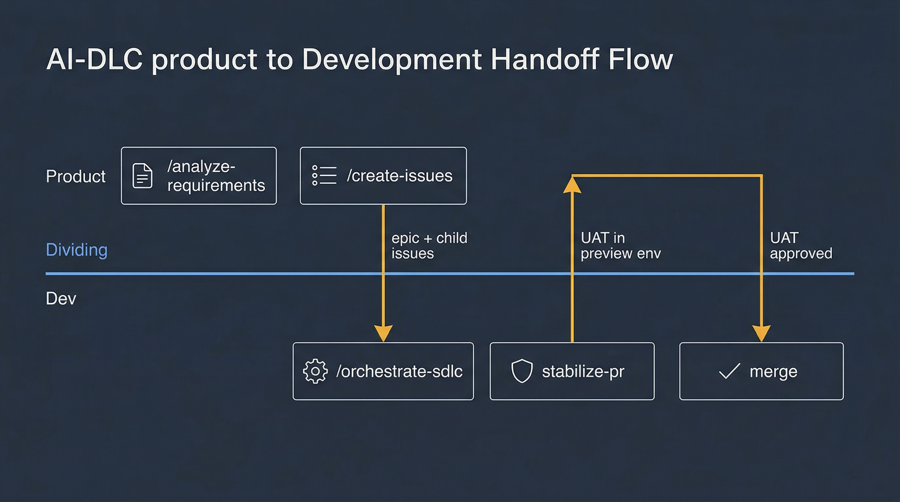

# Playbook — Product ↔ Dev Collaboration

You are a product manager, designer, or other non-developer working with a developer who uses the AI-DLC system. Or you are the developer who wants to set up a clean handoff with a product partner. This playbook shows how both sides drive parts of the SDLC, where the handoffs happen, and how to run UAT back and forth without stepping on each other.



## Who runs what

The AI-DLC system is not dev-only. Several skills are designed for the product side to run directly:

| Skill | Who runs it | Output |
|-------|-------------|--------|
| `/discover` | **Product** | `${DLC_ARTIFACT_ROOT:-ai_dlc_artifacts}/discovery/YYYY-MM-DD-<slug>.discovery.md` |
| `/analyze-requirements` | **Product** | `${DLC_ARTIFACT_ROOT:-ai_dlc_artifacts}/<slug>/requirements.prd.md` |
| `/create-issues` | **Product** (or dev) | GitHub issues (epic + children) |
| `/orchestrate-sdlc` | **Dev** | Feature branch, PRs, merge-ready code |
| `/hotfix` | **Dev** | Hotfix branch and PR |
| `/finalize-sdlc` | **Dev** | Post-merge validation and issue closure |

The key insight: Product owns **intent** (the PRD, the issues, the acceptance criteria). Dev owns **execution** (the design, the code, the PR). Each side uses the skill that matches its role.

## 0. Product side — discovery for raw ideas (optional)

If your idea is still unformalized — you have a rough concept but no clear scope, user stories, or acceptance criteria — run product discovery before writing a PRD:

```
/discover I'm thinking about adding an AI-powered recommendation engine
```

The skill asks you to choose a product framework (or select "Help me choose" for guided recommendation):

- **JTBD + Lean Canvas** — best for validating customer needs and business model (default)
- **SWOT + Kano** — best for competitive positioning and feature prioritization
- **Porter's Five Forces + BMC** — best for market dynamics and strategic analysis
- **Opportunity Solution Tree** — best for mapping outcomes to opportunities and tests
- **Working Backward (PR/FAQ)** — best for pressure-testing a concept via customer narrative

The output is a structured discovery brief (`discovery.md`) with framework analysis, MoSCoW backlog, RAID log, and scope-cluster recommendations. It feeds directly into `/analyze-requirements` in the next step.

**Skip this step** if you already have a clear feature description, a product brief, or a GitHub issue with defined scope. See [product-discovery reference](https://github.com/posterity-ventures/dlc-plugin/blob/main/docs/skills-guide/skills/product-discovery.md) for the full workflow.

## 1. Product side — starting from a brief

You have a product brief: a one-pager describing the problem, the users, the success metric, and the rough shape of the solution. Turn it into a PRD:

```
/analyze-requirements
```

Paste the brief when asked. The skill will:

1. Ask clarifying questions (user persona specifics, edge cases, acceptance criteria gaps).
2. Draft a full PRD with numbered acceptance criteria, scope, out-of-scope, non-functional requirements, and open questions.
3. Stop at a checkpoint for your approval.

You edit the PRD in place. It lands at `${DLC_ARTIFACT_ROOT:-ai_dlc_artifacts}/<slug>/requirements.prd.md`. The PRD is a markdown file in the repo — commit it on a branch so dev can see it.

See [analyze-requirements reference](https://github.com/posterity-ventures/dlc-plugin/blob/main/docs/skills-guide/skills/analyze-requirements.md) for the full workflow.

## 2. Product side — creating the tracking issues

Once the PRD is in good shape:

```
/create-issues
```

The skill reads the PRD, proposes an epic issue plus one child issue per major deliverable, and shows you the proposed titles/bodies/labels before creating anything. You approve, the issues get created in GitHub, and you have a ticket structure dev can work from.

The epic issue is the single place product and dev both watch for progress. Every child PR links to the epic; `finalize-sdlc` ticks the epic checklist as each child merges.

## 3. Handoff

Share the epic issue number with dev. That is the whole handoff:

> "Epic #1447 is ready. Start with #1448 — it has the first acceptance criteria and is unblocked."

Dev takes it from there. They run:

```
/orchestrate-sdlc 1448; confident
```

The orchestrator reads the linked PRD from the artifact directory, produces a tech design, implements, opens a PR. Product does not need to be in the loop during Phase 2c–4.

## 4. Dev side — reading the PRD

When dev receives an issue number, the orchestrator automatically reads:

- The issue body (short description, acceptance criteria)
- The linked PRD at `${DLC_ARTIFACT_ROOT:-ai_dlc_artifacts}/<slug>/requirements.prd.md` (full detail)
- The epic issue's strategic context (if linked)

If the PRD is missing or incomplete, `analyze-requirements` will be re-invoked inline and will ask **product** for the missing pieces via a comment on the issue. You (product) will see the question in your GitHub notifications, not in a Claude Code session — which is how cross-team collaboration scales.

## 5. Mid-SDLC clarifications

During implementation, dev may hit an ambiguity. Two options:

- **Small ambiguity**: dev makes a judgment call and notes it in the tech design's Decisions Log. Product reviews it at UAT.
- **Large ambiguity**: the orchestrator escalates by posting a comment on the issue tagging product with a specific question and waits for a reply. Dev does not try to guess.

The [sdlc-intake reference](https://github.com/posterity-ventures/dlc-plugin/blob/main/docs/skills-guide/skills/sdlc-intake.md) documents this handoff. It is the same mechanism the orchestrator uses for escalations to its human user — just routed through GitHub comments when the human is on the product side.

## 6. UAT — when the PR is ready

When `stabilize-pr` declares the PR merge-ready, dev posts a UAT comment on the epic issue tagging product:

> "PR #1499 is merge-ready for issue #1448. Deployed to the preview environment at <URL>. Acceptance criteria 1–5 verified by reviewer; please UAT and comment approve/reject."

Product runs UAT **in the preview environment**, not locally. For UI changes, product looks at the actual screens. For backend changes, product hits the endpoints via a test tool or the app's dev panel.

If UAT passes: product comments "approved" on the PR. Dev merges.

If UAT fails: product comments the specific failure on the PR (inline comment on the relevant file if possible, or a top-level comment with a reproduction). Dev runs:

```
resume the SDLC for <slug>, re-enter phase 5 with UAT failure: <what product reported>
```

`stabilize-pr` re-triages and fixes. Loop until UAT passes.

## 7. Post-merge — product side

After merge, `finalize-sdlc` runs automatically. Product sees:

- A structured closeout comment on the issue listing the merged PR, deploy time, and smoke-test results.
- A tick in the epic checklist.

Product closes the epic when all children have ticked. Product also runs post-launch metrics checks according to whatever their normal cadence is — the SDLC system does not replace product analytics.

## 8. Cross-role etiquette

A few things that make the collaboration work:

- **Product does not hand-edit code.** If the code does not match the PRD, comment on the PR or re-run requirements. Do not open VS Code and fix it.
- **Dev does not rewrite the PRD.** If the PRD is wrong, escalate via comment on the issue. Let product update it.
- **Neither side bypasses the SDLC for "just a small change."** Every change goes through the orchestrator or hotfix skill so the audit trail stays clean.
- **Both sides read the Decisions Log.** `state.md` under Decisions Log records every non-trivial choice. Check it before asking "why did we do X this way?"
- **Product uses preview environments, not local dev.** Your laptop will not have the right data; the preview environment will.

## 9. When product is also the developer

If one person is doing both roles (solo founder, small team), run everything sequentially in one session:

```
/analyze-requirements
/create-issues
/orchestrate-sdlc <issue-number>; confident
```

The handoff steps above are still useful as **self-checkpoints**: after each skill, stop and ask yourself "if a teammate took this over, would they have enough context?" If not, add more to the PRD or the issue body before moving on.

## 10. Common collaboration pitfalls

- **PRD too vague for tech design.** `produce-tech-design` will ask clarifying questions that bounce back to product. Prevent with concrete, testable acceptance criteria.
- **Dev merges without UAT.** The system does not require UAT by default — it is a convention, not a hard gate. Agree on "UAT required" as a team norm.
- **Product comments on code style.** That is `review-pr`'s job, not product's. Product comments on behavior and acceptance.
- **Dev reinterprets the PRD silently.** Decisions belong in the Decisions Log, not in commit messages that product will never read.
- **Issue and PRD drift.** Always keep the PRD as the source of truth. If the issue description diverges, update the issue or update the PRD — do not leave them inconsistent.

## Next

- First time doing this? Both sides should skim [core-workflow.md](../core-workflow.md).
- Product wants to understand the dev side: see [greenfield.md](greenfield.md) and [brownfield.md](brownfield.md) for the dev walkthroughs.
- Dev wants to understand the product side: the product-facing skills are [product-discovery](https://github.com/posterity-ventures/dlc-plugin/blob/main/docs/skills-guide/skills/product-discovery.md), [analyze-requirements](https://github.com/posterity-ventures/dlc-plugin/blob/main/docs/skills-guide/skills/analyze-requirements.md), and [create-issues](https://github.com/posterity-ventures/dlc-plugin/blob/main/docs/skills-guide/skills/create-issues.md).
