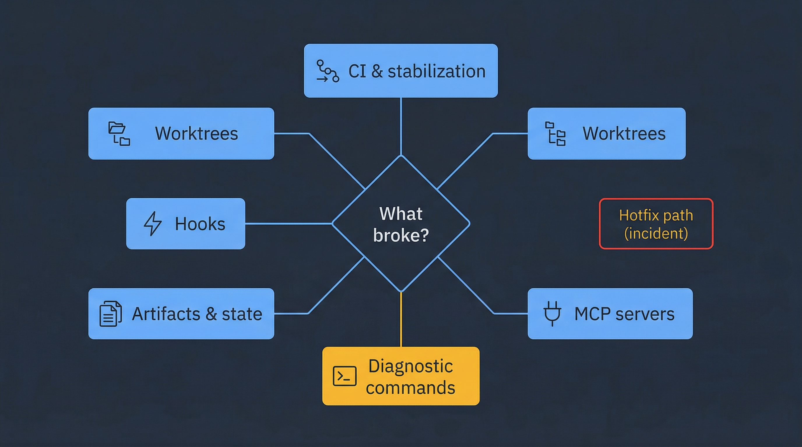

# Playbook — Troubleshooting

Things go wrong. This playbook is a flat list of failure modes you will hit with the AI-DLC system and the specific commands to recover. Read it front-to-back once so you know what is in it; later, `Ctrl-F` the symptom when you need it.



## How to use this playbook

Each entry has four parts:

- **Symptom** — what you see
- **Likely cause** — the usual root cause (not always the only one)
- **Fix** — the specific commands or actions to recover
- **Prevention** — how to avoid next time

If the symptom you see does not match anything here, start with the [diagnostic commands](#diagnostic-commands) at the bottom.

---

## CI and stabilization

### CI fails the same way twice after `stabilize-pr` "fixed" it

- **Likely cause**: the fix addressed a symptom, not a root cause, and `stabilize-pr` is burning its retry budget on the same strategy.
- **Fix**: Stop the stabilization loop (`Ctrl-C` if in interactive mode, or wait for it to hit its iteration cap). Read the full CI log yourself — `gh run view <run-id> --log-failed`. Then restart stabilization with an explicit diagnosis:
  ```
  resume the SDLC for <slug>, stabilize Phase 5 with explicit diagnosis: <what you observed>
  ```
- **Prevention**: The [ci-stabilization rule](../../../rules/ci-stabilization.md) caps retries at 3 and requires reading the full log each time. Trust the rule.

### Stabilization loops forever without making progress

- **Likely cause**: the reviewer finds new things on every pass because earlier fixes introduced new problems.
- **Fix**: Stop the loop. Open the PR in GitHub and read the reviewer's most recent comment. Fix the highest-severity item yourself, push, and let stabilization pick up from there. You are allowed to be in the loop — that is what the "no-progress counter" in `babysit-pr` is meant to surface. See [babysit-pr reference](../../skills-guide/skills/babysit-pr.md).
- **Prevention**: Do not use autopilot on first-time stabilization runs in an unfamiliar subsystem.

### Stabilization makes changes that break local dev

- **Likely cause**: stabilization only runs unit tests; it does not validate that the dev server still boots.
- **Fix**: Revert the last stabilization commit, run the dev server locally, identify the broken file, re-apply the stabilization change by hand with the fix.
- **Prevention**: For UI changes, Phase 6 E2E testing catches this. For backend changes, run the dev server once after stabilization before merging.

---

## Worktrees

### `git worktree add` fails with "branch already checked out"

- **Likely cause**: another worktree already has the branch checked out. Usually from a previous SDLC run that did not clean up.
- **Fix**:
  ```bash
  git worktree list
  # Identify the stale worktree
  git worktree remove .worktrees/<stale-slug>
  git worktree prune
  ```
  Then retry the original operation.
- **Prevention**: Run `git worktree list` before starting long-running work. Clean up merged branches' worktrees.

### Files exist in one worktree but not another, and you expected them in both

- **Likely cause**: worktrees are isolated by design — each has its own working directory. They share `.git/` but not the checkout.
- **Fix**: Nothing to fix — this is correct behavior. If you need the file in both, commit it and rebase the other branch.
- **Prevention**: Read [worktree-safety rule](../../../rules/worktree-safety.md) once. The mental model is "each worktree is its own checkout."

### You accidentally ran a skill in the main repo directory instead of a worktree

- **Likely cause**: you `cd`'d back to the repo root during an SDLC run "just to check something" and then invoked a skill there.
- **Fix**: Check `state.md` for the `Worktree:` field. `cd` to that path. If the skill committed changes to the wrong branch, identify the commits with `git log`, cherry-pick them onto the feature branch, and revert the commits on the wrong branch.
- **Prevention**: Every orchestrator resume first verifies the working directory. Do not fight that check.

---

## Hooks

### A hook fails and blocks every tool call

- **Likely cause**: a `PreToolUse` hook is returning non-zero. This is intended behavior for validation hooks, but a bug in the hook script will look the same.
- **Fix**: Read the hook error in the tool call output. Run the hook command manually with the same args to reproduce. Fix the script or (if the hook is broken) comment it out in `.claude/settings.json` temporarily and file an issue. Never `--no-verify` past a hook without understanding why it failed.
- **Prevention**: When editing `.claude/hooks/*.sh`, run the script directly before committing.

### Hooks are silently not firing

- **Likely cause**: the hook is not wired into `.claude/settings.json`, or the matcher regex does not match the tool name.
- **Fix**: Check `.claude/settings.json` for the `hooks` block. Verify the `matcher` regex matches the event type. Test with a trivial `echo` command. See [hooks reference](../../skills-guide/hooks.md) for the matcher syntax.
- **Prevention**: Add new hooks one at a time, verify each one fires before adding the next.

### Pre-push hook runs tests that take 10 minutes

- **Likely cause**: a pre-push hook is running the full test suite instead of unit tests only.
- **Fix**: Check `.claude/hooks/pre-push.sh` or equivalent. Restrict it to unit tests only per the [ci-stabilization rule](../../../rules/ci-stabilization.md).
- **Prevention**: Hooks should be fast. If a hook is slow, it will get disabled.

---

## Artifacts and state

### `state.md` disagrees with the phase status table

- **Likely cause**: a skill updated the header `Current phase:` line but forgot to update the table row (or vice versa).
- **Fix**: Trust `Current phase:` — that is the routing source of truth per the [sdlc-intake reference](../../skills-guide/skills/sdlc-intake.md). Hand-edit the table to match. Log the discrepancy in the Decisions Log so the next resume knows you reconciled it.
- **Prevention**: Only skills should update `state.md`. If you have to hand-edit it, that is a sign the skill hit an edge case — consider reporting it.

### `${DLC_ARTIFACT_ROOT:-ai_dlc_artifacts}/<slug>/` is missing a file the orchestrator expects

- **Likely cause**: the orchestrator started a new run but the previous run's cleanup removed too much.
- **Fix**:
  ```
  resume the SDLC for <slug>, reconstruct missing artifacts from git history
  ```
  The orchestrator will read commits on the feature branch and regenerate the missing files where possible. If that fails, start a fresh run with a new slug and copy over what you can.
- **Prevention**: Do not `rm -rf ${DLC_ARTIFACT_ROOT:-ai_dlc_artifacts}/` between runs. `finalize-sdlc` handles cleanup — let it.

### Stale artifact directories are piling up

- **Likely cause**: many completed SDLC runs whose artifacts were kept for audit but never archived.
- **Fix**: Per [maintain-docs reference](../../skills-guide/skills/maintain-docs.md), the distinction is **permanent vs transient**. Permanent artifacts (PRD, design, review reports) stay. Transient artifacts (`state.md`, `telemetry.jsonl`, scratch plans) can be removed after merge. `finalize-sdlc` does this automatically — if it hasn't, run `/finalize-sdlc <slug>` on the old runs.
- **Prevention**: Run `finalize-sdlc` on every merged SDLC run, even if the feature was merged outside the orchestrator.

---

## MCP servers

### MCP server fails to start on Claude Code launch

- **Likely cause**: missing env vars, or the MCP binary is not installed.
- **Fix**: Read the error line in the startup log. It will name the specific var or binary. Check `.env` against [mcp.md](../../skills-guide/mcp.md#environment-variables) for the list. Restart Claude Code after fixing.
- **Prevention**: Keep `.env` up to date with the latest required vars. The list is in `mcp.md`.

### `mcp__context7__resolve-library-id` returns nothing for a library you know exists

- **Likely cause**: the library has a non-obvious canonical name in context7's index.
- **Fix**: Call `resolve-library-id` with several alternative names (the package name, the GitHub org/repo, the common English name). If none work, fall back to web search this once — do not rely on training data.
- **Prevention**: None — this is an upstream index issue.

### `mcp-image` generation fails repeatedly

- **Likely cause**: moderation filter, API quota, or an image prompt with negative phrasing.
- **Fix**: Per [image-generation reference](../../skills-guide/skills/image-generation.md), rewrite the prompt to be positive-only ("include a red door" instead of "no green doors"). If that fails, fall back to inline mermaid — it handles most structural diagrams well.
- **Prevention**: Author prompts positively from the start.

---

## Hotfix path

### Production is actively broken and you need to ship a fix now

This is the one path where you do not use `/orchestrate-sdlc`. Use `/hotfix` instead:

```
/hotfix <description of production issue>
```

The hotfix skill:

1. Branches from `prod` (not `main`) so the fix lands in production history.
2. Produces a minimal diff — no opportunistic refactoring.
3. Hard-pauses at two gates (design confirmation, push confirmation) even in autopilot.
4. Supports `revert` mode for reverting a specific commit without writing new code.
5. Writes a `state.md` with a skip-set so `finalize-sdlc` knows not to retry phases that the hotfix path handled inline.

See [hotfix skill reference](../../skills-guide/skills/hotfix.md) for the full 11-step flow.

**After the hotfix lands**, open a follow-up issue to forward-port the fix to `main` and `staging` (the hotfix skill does this automatically but confirm the PRs exist). This avoids the fix being lost at the next promotion.

---

## Diagnostic commands

When you do not know where to start, run these in order:

```bash
# What state is the current SDLC run in?
cat ${DLC_ARTIFACT_ROOT:-ai_dlc_artifacts}/*/state.md | head -30

# What worktrees exist and where are they?
git worktree list

# What branches are in play?
git branch -vv

# What is the recent decision log for the current run?
grep -A2 "AUTOPILOT DECISION\|Phase" ${DLC_ARTIFACT_ROOT:-ai_dlc_artifacts}/*/state.md | tail -40

# What hooks are wired up?
cat .claude/settings.json | grep -A2 hooks

# What MCP servers are configured?
cat .claude/settings.json | grep -A3 mcpServers

# Recent telemetry events for the current run
tail -20 ${DLC_ARTIFACT_ROOT:-ai_dlc_artifacts}/*/telemetry.jsonl 2>/dev/null
```

If telemetry is enabled, `${DLC_ARTIFACT_ROOT:-ai_dlc_artifacts}/<slug>/telemetry.jsonl` contains a line-per-event record of every tool call, subagent dispatch, and hook invocation. It is the single most useful diagnostic artifact when a run goes sideways. See [telemetry reference](../../skills-guide/telemetry.md).

---

## Escalation paths

### When the orchestrator hard-pauses for your judgment

You will see a message like `Escalation counter = 2, pausing for user input` with `escalation-context.md` referenced. Read that file — it contains the specific blocker. Reply with a decision, and the orchestrator will route accordingly:

- "Re-run phase 2c with this constraint: ..." → re-enters design with delta
- "Skip this finding as non-applicable: ..." → logs decision and continues
- "Abort the run and clean up" → graceful shutdown

### When you think the system is stuck in a loop you cannot escape

1. Stop the current session (`Ctrl-C` or close the terminal).
2. Read `state.md` and `escalation-context.md`.
3. If the state is recoverable, edit `state.md` to mark the failing phase `blocked` with a note, restart Claude Code, and type `resume the SDLC for <slug>`.
4. If the state is not recoverable, move the artifact directory aside (`mv ${DLC_ARTIFACT_ROOT:-ai_dlc_artifacts}/<slug> ${DLC_ARTIFACT_ROOT:-ai_dlc_artifacts}/_failed_<slug>_<date>`) and start fresh with a new slug. You did not lose the work — it is still in git history.

### When to file a bug report against the system itself

- A skill crashes with an internal error rather than a controlled escalation
- A hook blocks all tool calls and the hook script is correct
- The orchestrator routes to a phase that does not exist
- State file schema appears corrupted on resume

File against the `k2_mvp` repo with the failing `state.md`, the last 100 lines of `telemetry.jsonl`, and a description of what you invoked.

---

## Next

- Back to normal work: [core-workflow.md](../core-workflow.md), [greenfield.md](greenfield.md), [brownfield.md](brownfield.md).
- Incident response runbook: [hotfix skill reference](../../skills-guide/skills/hotfix.md).
- Learn the building blocks so you can diagnose faster: [skills-guide concepts](../../skills-guide/concepts.md).
