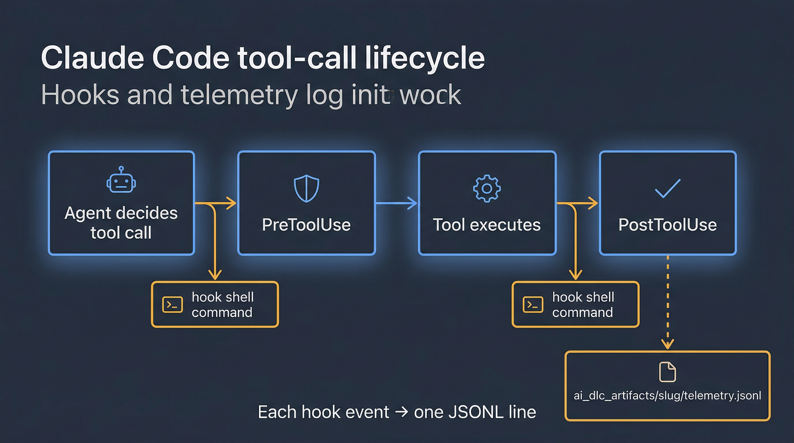
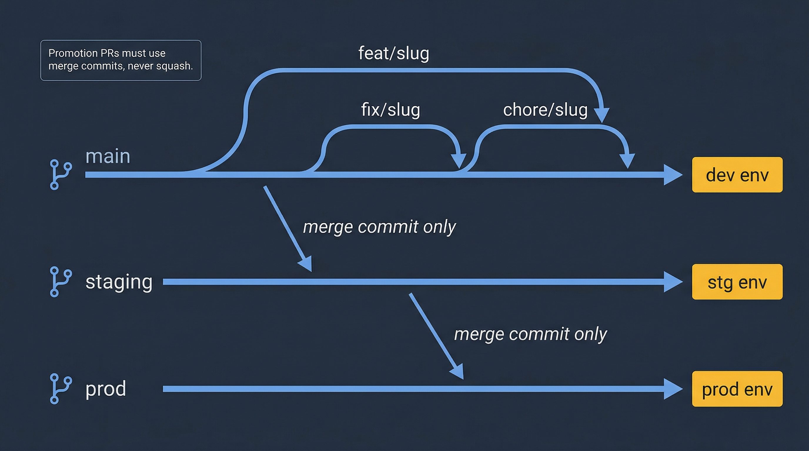

# Cheatsheet

One-page condensed reference. Keep it open in a side tab while you work.

## Invocations

| Command | What it does |
|---------|--------------|
| `/orchestrate-sdlc <feature>; <mode>` | Full SDLC run. Modes: `interactive`, `confident` (default), `autopilot` |
| `/orchestrate-sdlc <issue-number>; <mode>` | Full SDLC run anchored to a GitHub issue |
| `/run` / `/next` | Aliases for `/orchestrate-sdlc`. `/next` = resume from `state.md` |
| `/product-discovery` or `/discover <idea>` | Turn a raw idea into a `discovery.md` brief (framework-driven) |
| `/analyze-requirements` or `/reqs` | Turn a brief into a PRD |
| `/create-issues` or `/issues` | Decompose a PRD into GitHub issues |
| `/produce-tech-design` or `/design` | Write a tech design from a PRD |
| `/plan-implementation` or `/plan` | Generate an epic implementation plan |
| `/map-codebase` or `/map <subsystem>` | Fast parallel codebase map |
| `/new-feature <description>` | Cold-start front door for unfamiliar codebases |
| `/hotfix <description>` | Minimal-diff hotfix branched from `prod` |
| `/review-pr <PR>` or `/review` | Interactive PR review |
| `/babysit-pr <PR>` or `/babysit` | Long-running review-stabilize loop |
| `/prepare-pr` or `/ship` | Open the PR |
| `/stabilize-pr` or `/stabilize` | Drive CI + review to green |
| `/verify` | Phase 6.5 UAT screenshot checkpoint |
| `/finalize-sdlc <slug>` or `/finalize` | Post-merge cleanup and closeout |
| `/maintain-docs` | Documentation drift check and update |
| `/image-generation <description>` | Structured image generation via mcp-image |
| `/help` | In-session cheatsheet — verb → canonical skill + common workflows |

See the [skills quickref aliases table](skills-quickref.md#alias-commands) for the full alias → canonical mapping.

## Interaction modes

| Mode | Checkpoints | Use when |
|------|-------------|----------|
| `interactive` | Every step | Learning the system, risky/unfamiliar work |
| `confident` | Major phase boundaries | Normal work (default) |
| `autopilot` | Hard-pause gates only | Overnight runs, trusted work |

**Hard-pause gates (all modes)**: direct pushes to `main`/`staging`/`prod` (refused), `hotfix` confirmation gates, Phase 8 deployment gate.

## Phase map

| Phase | Owner | Output |
|-------|-------|--------|
| 1 | sdlc-intake → analyze-requirements | `requirements.prd.md` |
| 2a | sdlc-intake | Scope assessment (logged) |
| 2b | sdlc-intake → review-security / review-ux | `analysis_output/*.md` (conditional) |
| 2c | sdlc-intake → produce-tech-design | `designs/tech-design.md` |
| 3 | sdlc-implement | Epic commits on feature branch |
| 4 | sdlc-deliver → prepare-pr | PR opened |
| 5 | sdlc-deliver → review-pr + stabilize-pr | Merge-ready PR |
| 6 | sdlc-deliver → build-e2e-tests (conditional) | E2E green |
| 7 | You | Click merge in GitHub |
| 8 | sdlc-finalize → finalize-sdlc | Issue closed, epic ticked |

## Hooks (`.claude/settings.json`)



Hooks are shell commands the harness runs on events. Configured under the `hooks` key in `.claude/settings.json`:

| Event | Fires | Typical use |
|-------|-------|-------------|
| `PreToolUse` | Before every tool call | Validation, permission gates |
| `PostToolUse` | After every tool call | Telemetry, side-effect logging |
| `SubagentStart` | When a subagent is dispatched | Start telemetry timer |
| `SubagentStop` | When a subagent returns | Record duration, emit event |

See [hooks reference](https://github.com/posterity-ventures/dlc-plugin/blob/main/docs/skills-guide/hooks.md) for matcher syntax and examples.

## Telemetry

`${DLC_ARTIFACT_ROOT:-ai_dlc_artifacts}/<slug>/telemetry.jsonl` — one JSON object per event, line-delimited. Useful fields:

- `event` — event name (`tool_call`, `subagent_dispatch`, `hook_fire`, `phase_transition`)
- `timestamp` — ISO 8601 UTC
- `tool` / `agent` / `skill` — which component fired the event
- `duration_ms` — wall-clock duration
- `outcome` — `success` / `failure` / `blocked`

Diagnostic one-liner:

```bash
tail -20 ${DLC_ARTIFACT_ROOT:-ai_dlc_artifacts}/<slug>/telemetry.jsonl | jq -c '{event, tool, outcome, duration_ms}'
```

See [telemetry reference](https://github.com/posterity-ventures/dlc-plugin/blob/main/docs/skills-guide/telemetry.md).

## Rules (`.claude/rules/`)



Auto-loaded into every conversation. Precedence: project rules → user rules → system defaults. The rules in this repo:

> **Branching model**: the plugin reads the model from `.claude/branching.json` and supports four presets — `gitlab-flow` (default), `github-flow`, `gitflow`, and `trunk-based`. Skills that depend on branch names (`hotfix`, `prepare-pr`, `push-protection`) consume it automatically via `skills/_shared/branching-model.sh`. See [core-workflow.md §9](../core-workflow.md#9-branching-model-assumptions--read-this-if-youre-adopting-claude-in-another-repo).

| Rule | Summary |
|------|---------|
| [branching.md](https://github.com/posterity-ventures/dlc-plugin/blob/main/rules/branching.md) | Configurable via `.claude/branching.json`. Defaults to GitLab Flow (`feature/* → main → staging → prod`, promotion PRs merge-commit only) |
| [push-protection.md](https://github.com/posterity-ventures/dlc-plugin/blob/main/rules/push-protection.md) | Never push directly to protected branches |
| [worktree-safety.md](https://github.com/posterity-ventures/dlc-plugin/blob/main/rules/worktree-safety.md) | Worktree isolation, no force checkout, max 2 retries |
| [ci-stabilization.md](https://github.com/posterity-ventures/dlc-plugin/blob/main/rules/ci-stabilization.md) | Unit tests only locally, max 3 fix-push iterations, read full CI log |
| [task-scope.md](https://github.com/posterity-ventures/dlc-plugin/blob/main/rules/task-scope.md) | Do exactly what was asked; confirm before extras |
| [prompt-standards.md](https://github.com/posterity-ventures/dlc-plugin/blob/main/rules/prompt-standards.md) | Layered XML prompt architecture, version headers, failure patterns |
| [claude-md-governance.md](https://github.com/posterity-ventures/dlc-plugin/blob/main/rules/claude-md-governance.md) | CLAUDE.md is 40-line cap; rules live in `.claude/rules/` |

## Artifact directory layout

```
${DLC_ARTIFACT_ROOT:-ai_dlc_artifacts}/<slug>/
├── state.md                    # Single source of truth for resume
├── requirements.prd.md         # Phase 1 output
├── analysis_output/
│   ├── SECURITY_REVIEW_REPORT.md  # Phase 2b (conditional)
│   └── UX_REVIEW_REPORT.md        # Phase 2b (conditional)
├── designs/
│   └── tech-design.md          # Phase 2c output
├── plans/
│   └── epic-<n>-plan.md        # Phase 3 epic plans
├── telemetry.jsonl             # Append-only event log
├── escalation-context.md       # Written on blocked phase
└── pr-status.json              # babysit-pr / stabilize-pr progress
```

**Permanent** (keep after merge): `requirements.prd.md`, `designs/tech-design.md`, `analysis_output/`.
**Transient** (cleaned by finalize-sdlc): `state.md`, `telemetry.jsonl`, `plans/`, `pr-status.json`, `escalation-context.md`.

## Worktree operations

```bash
# Create a worktree (sdlc-intake does this automatically)
git worktree add .worktrees/<work-type>/<slug> -b <work-type>/<slug>

# List all worktrees
git worktree list

# Remove a merged worktree
git worktree remove .worktrees/<slug>

# Prune stale worktree metadata
git worktree prune
```

See [worktree-safety rule](https://github.com/posterity-ventures/dlc-plugin/blob/main/rules/worktree-safety.md).

## MCP servers

Configured in `.claude/settings.json` under `mcpServers`. In this repo:

| Server | Purpose | Key tools |
|--------|---------|-----------|
| `context7` | Current library/framework documentation | `resolve-library-id`, `query-docs` |
| `mcp-image` | Image generation (Gemini-backed) | `generate_image` |

See [mcp reference](https://github.com/posterity-ventures/dlc-plugin/blob/main/docs/skills-guide/mcp.md).

## Diagnostic one-liners

```bash
# Current phase for every in-flight SDLC
grep "Current phase" ${DLC_ARTIFACT_ROOT:-ai_dlc_artifacts}/*/state.md

# Recent decisions across all runs
grep -h "AUTOPILOT DECISION\|Phase" ${DLC_ARTIFACT_ROOT:-ai_dlc_artifacts}/*/state.md | tail -40

# Stale hooks or broken settings
cat .claude/settings.json | jq '.hooks, .mcpServers'

# Last 10 tool calls for a specific run
tail -10 ${DLC_ARTIFACT_ROOT:-ai_dlc_artifacts}/<slug>/telemetry.jsonl | jq -c .

# PR and CI state
gh pr checks <PR-number>
gh run view <run-id> --log-failed
```

## Commit conventions

`<type>(<scope>): <description>` — see [CLAUDE.md](https://github.com/posterity-ventures/dlc-plugin/blob/main/CLAUDE.md).

Types: `feat`, `fix`, `chore`, `refactor`, `test`, `docs`, `ci`.

No Claude attribution lines. No Co-Authored-By trailers.

## When to stop and ask the human

- Escalation counter ≥ 2 in autopilot
- Design-level blocker (tech design needs a delta)
- Security or UX finding above `MINOR`
- CI failure whose log you do not understand after reading it once
- Any action that would touch `.claude/` files without explicit request

## Related

- [Skills Quick Reference](skills-quickref.md)
- [Agents Quick Reference](agents-quickref.md)
- [Glossary](glossary.md)
- [Troubleshooting playbook](../playbooks/troubleshooting.md)
